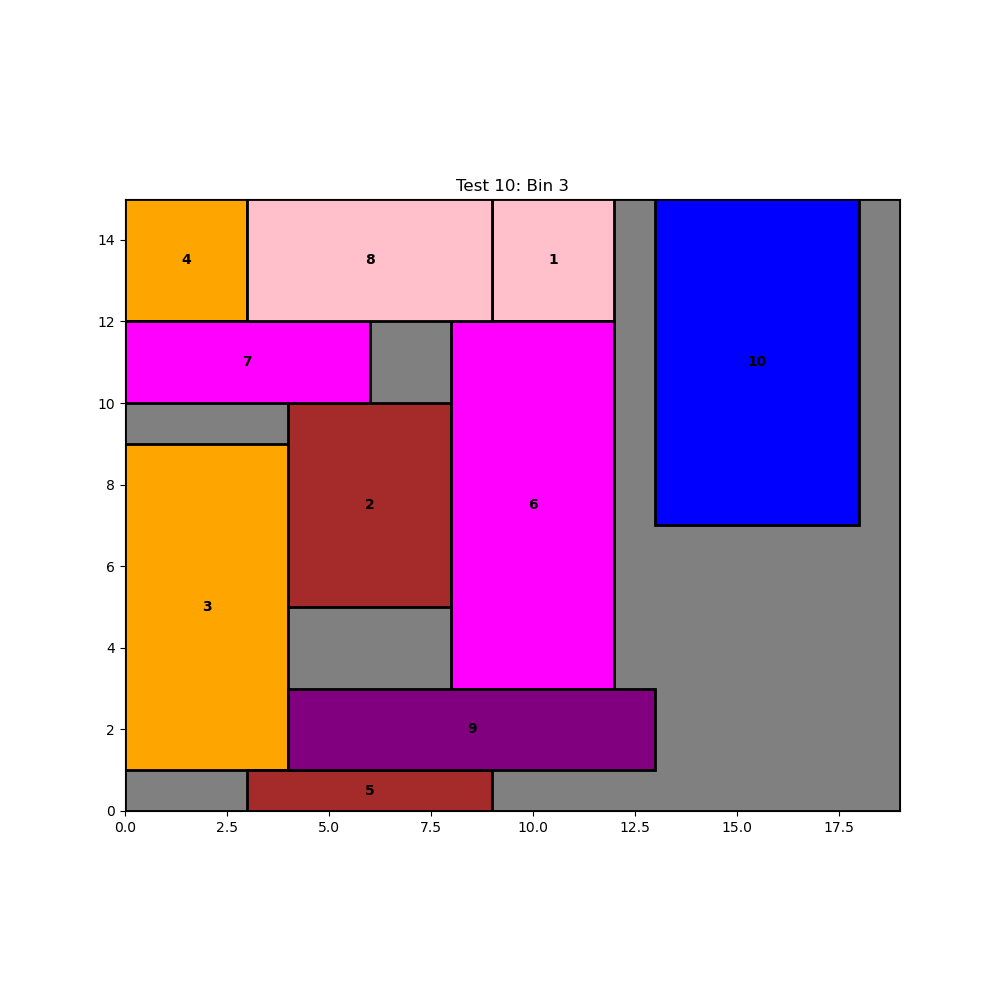

# Multiple-type, two-dimensional finite bin packing problem
This is a mini project for topic 3 in Fundamental of Optimization course of SoICT - HUST
## Problem
There are `K` trucks `1,2,...,K` for transporting `N` packages of `1, 2, ..., N`. Trucks have a container size of `Wk * Lk`. Each package `I` has size `wi * li`. Packages that are placed in same container must not overlap. Assume that the number K can be large, leading to a large number of trucks that are not being used. The cost of using truck `k` is `ck`. Find a way to put these package in the trucks so that **the total cost is minimal**.  

The input data format and how we generated them can be found [here](./input_data/README.md) 

## Modeling the problem
- CP model: Details are written in [this file](CP_model.pdf)
- MIP model:
- Heuristic: 

## Folder structure
```
.
├── CP_model.pdf            # how we model the problem
├── data_gen.py             # input data generator
├── assets
├── figure                  # contains generated figures
│   ├── generated_CP
│   │   └── ...
│   |── generated_HEU
│   |   └── ...
│   └── gen_figure.py       # figure generator
├── input_data              # contains generated data
│   └── ...
├── presentation
├── results                 # contains results from solver
│   └── ...
├── script                  # script file for collect result and gen figure
│   └── ...
└── solver_file             # contains solver files
    ├── CP_model_solver
    │   └── ...
    ├── Heuristic
    │   └── ...
    └── MIP_model.py
```

## The results
- Here we only collect the results based on **the number of bin used and total cost**.
- The results for each model are shown in the `results` folder.
- CP and MIP model solvers only receive input data up to **600 packages**   
- Example colab notebook [here](https://colab.research.google.com/drive/1ouxqr2eeJTfJou74Oxw4Syih_zFGgm2p?usp=sharing)  
- If you want to collect results by yourself, you can run the `collect_results` script by this command in the root dir of this repository:
```
./script/collect_results.sh {mode} {attempt}
```
Available solver modes: `CP1`, `CP2`, `MIP`, `HEU`

Example:
```
./script/collect_results.sh HEU 1
```  
The commmand above will collect the results created by [heuristic_main](/solver_file/Heuristic/) in the `1st attempt`    
  
**Note:**   
**- Read the script for more details**  
**- Change the attempt number for each attempt or the results will rewrite each other**
## Figure
- We have generated 16 figures (data from 7 to 24) for the results of CP solver **(because the running time is quite long for the large input data)** and all figures for Heuristic solver (No MIP because it take so long)  
- You can generate by running this command:  
```
./script/gen_figure.sh {mode}
```
Example figure for data `0010` generated by CP solver:  
  
  
  
**Note: Currently, the script can only generate figure for the CP and Heuristic solver** 